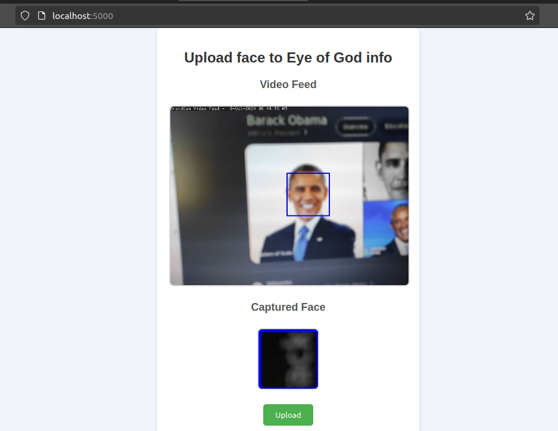

# Face Detection Web Application Documentation

## Overview
This web application is built using Flask and OpenCV to capture and upload images of faces detected by the camera. It utilizes a pre-trained Haar Cascade classifier for face detection. The captured image can be uploaded to an external API for further processing GlazBoga https://eyeofgodinfo.me/.

## Prerequisites
- Python 3.x
- Flask
- OpenCV (`cv2`)
- Requests library

You can install the required packages using:
```bash
pip install Flask opencv-python requests
```

## Code Structure

### Imports
```python
import os
import cv2
from flask import Flask, Response, render_template, request, redirect, url_for, flash
import requests
```
- `os`: For directory management.
- `cv2`: For computer vision tasks (face detection).
- `Flask`: For web framework functionalities.
- `requests`: For making HTTP requests.

### Initialization
```python
app = Flask(__name__)
app.secret_key = 'your_secret_key'  # Needed for flashing messages
```
- Initializes the Flask application and sets a secret key for session management.

### Face Cascade Classifier
```python
face_cascade = cv2.CascadeClassifier(cv2.data.haarcascades + 'haarcascade_frontalface_default.xml')
```
- Loads a pre-trained Haar Cascade classifier for detecting faces.

### Directory Setup
```python
if not os.path.exists('static/captured_faces'):
    os.makedirs('static/captured_faces')
```
- Creates a directory to store captured face images if it doesn't already exist.

### Frame Generation Function
```python
def generate_frames():
    cap = cv2.VideoCapture(0)  # Open the default camera
```
- Opens the default camera and continuously captures frames to detect faces.

```python
def generate_frames():
    cap = cv2.VideoCapture("http://192.168.1.101:4747/video")  # Open the default camera
```
- Connect to remote camera on android phone using DroidCam app

#### Face Detection Logic
- Each frame is converted to grayscale for processing.
- The `detectMultiScale` method is used to identify faces.
- Detected faces are highlighted with rectangles, and the first detected face is saved to a file.

### Routes
1. **Index Route**
   ```python
   @app.route('/')
   def index():
       image_exists = os.path.exists(captured_image_path)
       return render_template('index.html', image_exists=image_exists)
   ```
   - Renders the main page of the application. It checks if a captured image exists to display it.

2. **Video Feed Route**
   ```python
   @app.route('/video_feed')
   def video_feed():
       return Response(generate_frames(), mimetype='multipart/x-mixed-replace; boundary=frame')
   ```
   - Streams the video feed from the camera, providing a continuous flow of frames to the client.

3. **Upload Route**
   ```python
   @app.route('/upload', methods=['POST'])
   def upload_file():
       ...
   ```
   - Handles file uploads. It reads the captured image file and sends it to an external API.
   - Responds based on the success or failure of the upload.

### Running the Application
```python
if __name__ == '__main__':
    app.run(debug=True)
```
- Starts the Flask web server in debug mode.

## Usage
1. **Start the Application**: Run the script to start the Flask server.
2. **Access the Web Interface**: Navigate to `http://127.0.0.1:5000` in your web browser.
3. **Capture and Upload**:
   - The application will display the video feed. The first detected face will be captured and saved.
   - The captured image will be automatically uploaded to the specified API Glaz Boga to get information about person.

## Configuration
- **API Key**: Replace `your_api_key_here` in the upload function with your actual API key to authenticate requests to the external API.
- **Secret Key**: Modify `your_secret_key` to a secure value for production use.

## Dependencies
- Ensure all dependencies are installed before running the application. The code is designed to work with Python 3.x.

## Notes
- This application assumes that a webcam is available and functional on the host machine.
- The upload functionality requires a valid API endpoint and key to work correctly.

---

# Results


